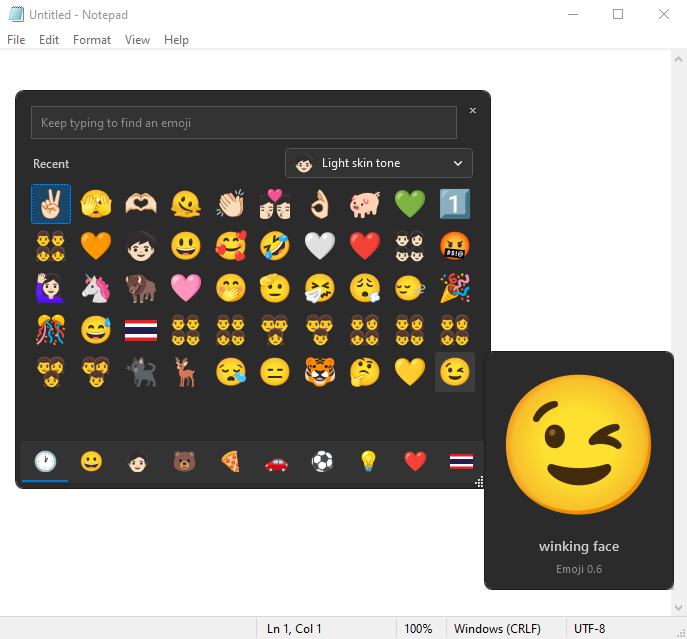

# Modern Emoji Picker และ Renderer

[English](./README.en.md)

Modern Emoji Panel ช่วยให้ Windows 10/11 ใช้ Unicode Emoji รุ่นใหม่ได้ครบทั้งการเลือกส่งและการแสดงผลบนเว็บ โดยแยกเป็นสองผลิตภัณฑ์ซึ่งติดตั้งร่วมกันหรือแยกกันได้

- **Modern Emoji Picker 0.1.9** — แอป WPF แบบ resident tray เรียกด้วย `Win + .` ค้นหาไทย/อังกฤษ แสดง Noto artwork และส่ง Unicode sequence ไปยังแอปเป้าหมาย
- **Modern Emoji Renderer 0.0.4** — Chrome Extension สำหรับแสดง Emoji ด้วย Noto Color Emoji บน Instagram Web DM, TikTok Web Chat, Facebook Messages/Inbox และ Messenger.com Inbox รวม bubble, reply story/note และ reactions

ทั้งสองผลิตภัณฑ์ทำงานในเครื่อง ไม่มี telemetry และไม่ต้องเชื่อมบัญชีหรือ backend ของโครงการ

## ภาพตัวอย่าง



Modern Emoji Picker แสดง Noto artwork, skin tone และ Hover Preview ขณะใช้งานร่วมกับ Notepad

## ดาวน์โหลด

ดาวน์โหลด Picker จาก [GitHub Release v0.1.9](https://github.com/xcrossth/Modern-Emoji-Panel/releases/tag/v0.1.9) และ Renderer จาก [GitHub Release renderer-v0.0.4](https://github.com/xcrossth/Modern-Emoji-Panel/releases/tag/renderer-v0.0.4)

| ผลิตภัณฑ์ | ไฟล์ | เหมาะสำหรับ |
|---|---|---|
| Picker — ตัวติดตั้ง | [Modern-Emoji-Picker-v0.1.9-setup-win-x64.exe](https://github.com/xcrossth/Modern-Emoji-Panel/releases/download/v0.1.9/Modern-Emoji-Picker-v0.1.9-setup-win-x64.exe) | แนะนำสำหรับผู้ใช้ทั่วไป ติดตั้งเฉพาะบัญชีปัจจุบันและเปิดพร้อม Windows ได้ |
| Picker — Portable | [Modern-Emoji-Picker-v0.1.9-portable-win-x64.zip](https://github.com/xcrossth/Modern-Emoji-Panel/releases/download/v0.1.9/Modern-Emoji-Picker-v0.1.9-portable-win-x64.zip) | แตกไฟล์แล้วใช้ได้ทันที ไม่ติดตั้ง |
| Chrome Renderer | [modern-emoji-renderer-0.0.4.zip](https://github.com/xcrossth/Modern-Emoji-Panel/releases/download/renderer-v0.0.4/modern-emoji-renderer-0.0.4.zip) | โหลดแบบ unpacked ใน Chrome |

ไฟล์ตรวจสอบ: [SHA256SUMS.txt](https://github.com/xcrossth/Modern-Emoji-Panel/releases/download/v0.1.9/SHA256SUMS.txt) สำหรับ Picker และ [modern-emoji-renderer-0.0.4.zip.sha256](https://github.com/xcrossth/Modern-Emoji-Panel/releases/download/renderer-v0.0.4/modern-emoji-renderer-0.0.4.zip.sha256) สำหรับ Renderer

## ติดตั้ง Modern Emoji Picker

### แบบตัวติดตั้ง — แนะนำ

1. ดาวน์โหลดไฟล์ `Modern-Emoji-Picker-v0.1.9-setup-win-x64.exe`
2. ตรวจ SHA-256 กับ `SHA256SUMS.txt`
3. ปิด Classic Emoji Picker จาก tray ก่อน หากยังใช้อยู่
4. เปิดตัวติดตั้งและทำตามขั้นตอน ไม่ต้องใช้สิทธิ์ administrator
5. เปิด Modern Emoji Picker แล้วกด `Win + .` จากช่องข้อความเพื่อใช้งาน

ตัวติดตั้งยังไม่มี code-signing certificate Windows SmartScreen จึงอาจแจ้งว่าไม่รู้จักผู้เผยแพร่ ให้ตรวจชื่อไฟล์และ SHA-256 จาก Release ทางการก่อนดำเนินการ และไม่จำเป็นต้องปิดระบบป้องกันของ Windows

### แบบ Portable

1. ดาวน์โหลด `Modern-Emoji-Picker-v0.1.9-portable-win-x64.zip`
2. แตก ZIP ไปยังโฟลเดอร์ที่เขียนได้และต้องการเก็บถาวร
3. เปิด `ModernEmojiPicker.exe`
4. หากต้องการเปิดพร้อม Windows ให้เปิดจาก Settings ภายในแอป

ทั้ง Installer และ Portable เป็น self-contained win-x64 จึงไม่ต้องติดตั้ง .NET Runtime แยก

## ติดตั้ง Modern Emoji Renderer บน Chrome

Chrome ไม่ติดตั้ง ZIP นอก Chrome Web Store โดยตรง จึงต้องแตกไฟล์แล้วโหลดแบบ unpacked

1. ดาวน์โหลด `modern-emoji-renderer-0.0.4.zip` และไฟล์ `.sha256`
2. ตรวจ SHA-256 แล้วแตก ZIP ไปยังโฟลเดอร์ถาวร
3. เปิด `chrome://extensions`
4. เปิด **Developer mode**
5. กด **Load unpacked** และเลือกโฟลเดอร์ที่แตก ZIP ซึ่งมี `manifest.json`
6. Refresh หน้า Instagram, TikTok, Facebook Messages หรือ Messenger.com ที่เปิดอยู่

เมื่ออัปเดตรุ่นใหม่ ให้แทนที่ไฟล์ในโฟลเดอร์เดิมแล้วกด **Reload** บนหน้า Extensions หรือแตกลงโฟลเดอร์ใหม่แล้ว Load unpacked ใหม่

Renderer จงใจไม่เปลี่ยน Emoji ภายในช่องพิมพ์ เพื่อรักษา caret, selection และ IME เมื่อส่งข้อความและกลายเป็น Display Content แล้วจึงแสดงด้วย Noto

## ตรวจ SHA-256 บน PowerShell

```powershell
(Get-FileHash .\Modern-Emoji-Picker-v0.1.9-setup-win-x64.exe -Algorithm SHA256).Hash.ToLower()
(Get-FileHash .\modern-emoji-renderer-0.0.4.zip -Algorithm SHA256).Hash.ToLower()
```

ค่า SHA-256 ของ release ปัจจุบัน:

| ไฟล์ | SHA-256 |
|---|---|
| Picker Installer | `f62e881d9a143bbe74486f4b82c75a902ee53b7083eb998893fdf76b43146582` |
| Picker Portable | `1fe2a0226bea343b3817c40c3c28d48fea1c401af47e73a153a3986ecbaba110` |
| Renderer ZIP | `9e8b17e19a65d1356b064ef2ca1928f27b469df61571c9c326fb5e4058c639c6` |

## ความสามารถหลัก

- รองรับ fully-qualified Emoji 17 ทุก sequence
- ค้นหาด้วยภาษาไทยและอังกฤษ
- แสดง Noto artwork ใน Picker พร้อม Hover Preview
- รองรับ skin tone, multi-person variants, Recent และ Learned Ranking บนเครื่อง
- ส่ง Emoji แบบ ordered queue พร้อม focus และ clipboard safety
- Renderer รองรับข้อความใหม่และการสลับห้องบน Instagram/TikTok/Facebook Messages/Messenger.com รวม image-Emoji และ reactions ของ Meta โดย Facebook รับรองเฉพาะ Messages/Inbox ไม่รวม post/comment
- ทำงาน offline โดยไม่มี analytics หรือ telemetry

## แพลตฟอร์มและข้อมูล

- Picker: .NET 10 WPF, self-contained `win-x64`
- Renderer: Chrome Manifest V3 พร้อม bundled Noto Color Emoji
- ทดสอบหลักบน Windows 10 Enterprise N 22H2 build 19045 x64 และ Chrome Stable
- Emoji Baseline: Unicode/Emoji 17.0, CLDR 48.2 และ Noto Emoji v2.051

## เอกสาร

- [คู่มือ Release และข้อควรระวัง](./docs/release/README.md)
- [คู่มือ Renderer ฉบับเต็ม](./apps/renderer-extension/README.md)
- [SPEC 01 — Modern Emoji Picker](./docs/specs/01-modern-emoji-picker.md)
- [SPEC 02 — Chrome Emoji Renderer Extension](./docs/specs/02-chrome-emoji-renderer-extension.md)
- [ผล Qualification](./docs/qualification/README.md)
- [นโยบายความปลอดภัย](./SECURITY.md)
- [แนวทางการมีส่วนร่วม](./CONTRIBUTING.md)
- [Domain glossary](./CONTEXT.md)
- [Architecture Decision Records](./docs/adr/)

## Build ในเครื่อง

```powershell
.\scripts\verify-foundation.ps1
.\scripts\release.ps1 -Version 0.1.9
.\scripts\build-renderer-release.ps1
```

Release workflow หลักทำงานในเครื่องและไม่บังคับใช้ GitHub Actions minutes ดูรายละเอียดที่ [scripts/README.md](./scripts/README.md)

## License

โค้ดของโครงการใช้ [MIT License](./LICENSE) และรักษา attribution ของ upstream, agent skills, Unicode และ Noto ตาม [THIRD-PARTY-NOTICES.md](./THIRD-PARTY-NOTICES.md)
