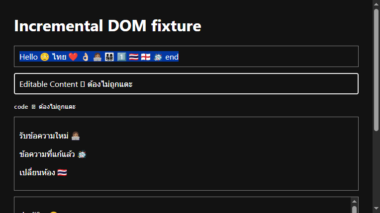

# ผลตรวจ Static และ Incremental DOM Renderer

Renderer ใช้ข้อมูลที่ generate แบบ deterministic จาก Emoji Baseline 17.0 ชุดเดียวกับ Picker จำนวน 3,944 sequence แล้วตัดข้อความด้วย `Intl.Segmenter` ระดับ grapheme ก่อน wrap เฉพาะ sequence ที่อยู่ใน baseline

## ขอบเขตความปลอดภัย

- surrounding Thai/English และ `textContent` คงเดิม
- selection, Copy ผ่าน user gesture, Browser Find และ DOM extraction คืน Unicode เดิม
- ข้าม `SCRIPT`, `STYLE`, `NOSCRIPT`, `INPUT`, `TEXTAREA`, `CODE`, `PRE`, `SELECT`, `OPTION` และ Editable Content ทั้ง subtree
- wrapper ที่ Renderer สร้างมี marker ของตัวเองและไม่ถูก wrap ซ้ำ
- production CSS โหลดเป็น Manifest content stylesheet จึงไม่พึ่ง inline style ที่อาจชนกับ Content Security Policy ของเว็บไซต์

## Dynamic pipeline

`MutationObserver` ส่งเฉพาะ added node หรือ text node ที่เปลี่ยนเข้า queue งาน ไม่ full-scan document ทุก mutation queue ใช้ `requestIdleCallback` และ fallback เป็น timer โดยจำกัด 250 text nodes ต่อ batch ตามค่าเริ่มต้น

Chrome fixture จำลอง initial content, ข้อความใหม่, ข้อความที่แก้, เปลี่ยนห้องผ่าน `history.pushState` และประวัติย้อนหลัง 600 ข้อความ ได้ผล:

- wrappers 612 ตัวตรงตามที่คาด
- ประมวลผล 660 text nodes ใน 15 batches
- Unicode, selection, Copy, Browser Find และ Editable Content safety ผ่านทั้งหมด
- เวลาประมวลผลใน fixture รอบที่เก็บหลักฐาน 18.7 ms



ข้อมูลดิบอยู่ที่ [`results/report.json`](./results/report.json)

รันซ้ำได้ด้วย:

```powershell
.\scripts\verify-renderer-foundation.ps1 -SkipInstall
.\scripts\verify-renderer-dom-fixture.ps1 -SkipBuild
```
