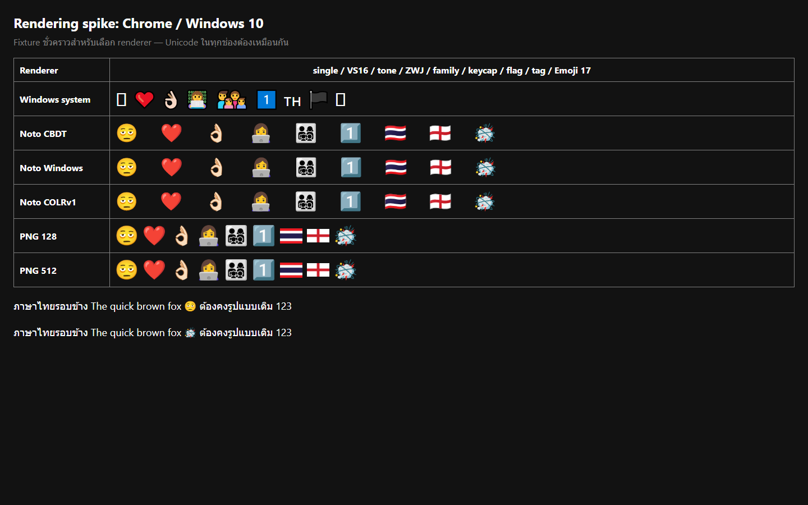
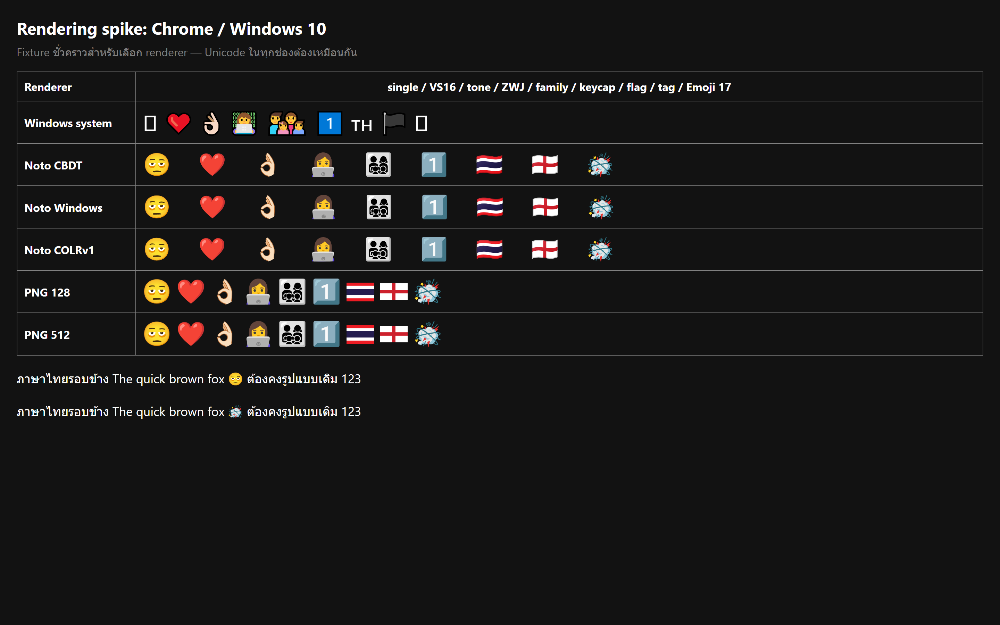
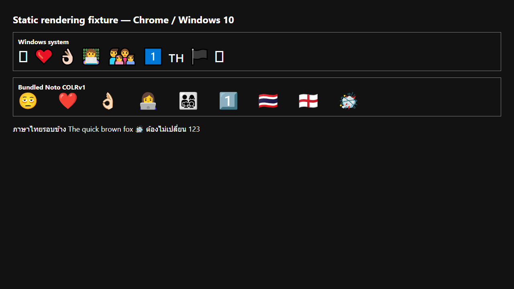

# ผลทดลอง Renderer บน Chrome และ Windows 10

## ข้อสรุป

เลือก **Noto COLRv1 v2.051 เป็น primary renderer** และเก็บ **PNG asset เป็น fallback เฉพาะเมื่อ embedded font โหลดไม่ได้**

เหตุผลหลักคือ COLRv1 แสดง Emoji ที่ Windows 10 เดิมไม่มีได้ครบทั้ง single code point, VS16, skin tone, ZWJ, family, keycap, regional flag, tag sequence และ Emoji 17.0 โดยไม่เปลี่ยน Unicode เดิม ภาพที่ 100% และ HiDPI 200% คมชัดเท่ากันกับ Noto แบบอื่น แต่ font มีขนาดประมาณ 5.0 MB ขณะที่ CBDT และ Windows-compatible มีขนาดประมาณ 10.7 MB

PNG 128 กับ PNG 512 ให้ภาพแทบไม่ต่างกันที่ขนาดข้อความ 32–40 CSS px ใน fixture นี้ การใช้ PNG เป็น primary จะเพิ่มภาระ mapping sequence, baseline, line height และ accessibility จึงไม่คุ้มเมื่อ COLRv1 ทำงานถูกต้อง ส่วน PNG 512 ยังเหมาะเป็นแหล่งภาพ fallback หรือ preview ขนาดใหญ่ในอนาคต

## สิ่งที่ทดสอบ

ทดสอบบน Windows 10 build 19045 ด้วย Chrome for Testing 152.0.7977.64 โดยเปรียบเทียบ:

- Windows `Segoe UI Emoji`
- Noto CBDT
- Noto CBDT รุ่น Windows-compatible
- Noto COLRv1
- Noto PNG 128 px
- Noto PNG 512 px

ผลที่เห็นจาก Windows system คือ Emoji 17.0 กลายเป็น tofu, regional flag แสดงเป็นตัวอักษร และ tag flag ไม่ประกอบเป็นธง ขณะที่ Noto ทั้งสาม font แสดงครบทุกกรณี





## Text integrity และ typography

fixture สร้างทุก renderer จาก Unicode ชุดเดียวกันและยืนยัน `textContent` แบบ byte-for-byte ในระดับ JavaScript ทุก mode ผ่านทั้งหมด surrounding Thai/English ใช้ `Segoe UI` เดิม และเปลี่ยน font เฉพาะ span ของ Emoji เท่านั้น

production fixture ยืนยันซ้ำว่า bundled COLRv1 โหลดจากไฟล์ local, Unicode ไม่เปลี่ยน และแสดงผลบน Chrome จริง:



ค่าที่ agent ตรวจซ้ำได้อยู่ใน `results/prototype-metrics.json` และ `results/production-fixture-report.json`

## Asset และการทำซ้ำ

- Upstream: [googlefonts/noto-emoji v2.051](https://github.com/googlefonts/noto-emoji/tree/v2.051)
- Font: `Noto-COLRv1.ttf`
- SHA-256: `0AE57FE58645638523BA35F388D93739D292539A9ACB84DF5700C81B1E1A28D2`
- License: SIL Open Font License 1.1 ที่ bundle อยู่ข้าง font
- Prototype branch: `codex/renderer-rendering-spike`, commit `a68f6d7`

รัน production fixture ซ้ำได้ด้วย:

```powershell
.\scripts\install-chrome-for-testing.ps1
.\scripts\verify-renderer-foundation.ps1 -SkipInstall
.\scripts\verify-renderer-static-fixture.ps1 -SkipBuild
```

คำสั่งนี้ใช้ Chrome for Testing กับ temporary profile ไม่แก้ Windows system font, registry, Chrome binary หรือโปรไฟล์จริงของผู้ใช้
