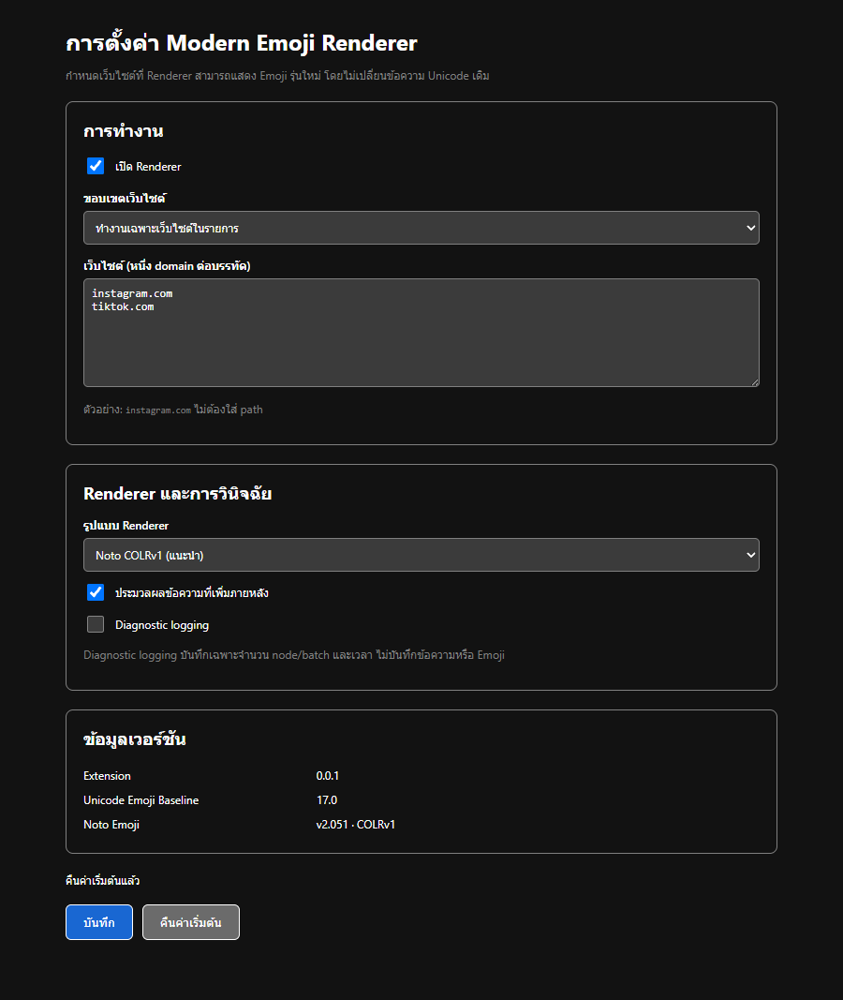
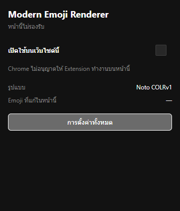

# Popup, Options และ Settings ของ Renderer

## พฤติกรรมที่ส่งมอบ

- Popup แสดงสถานะรายเว็บไซต์และจำนวน Emoji wrappers ปัจจุบัน โดย polling เฉพาะตัวเลขทุก 750 ms
- การปิดเว็บไซต์หยุด observer และแกะ wrapper กลับเป็น Unicode text เดิมทันที
- การเปิดเว็บไซต์ที่ยังไม่มี content script จะขอสิทธิ์เฉพาะ origin แล้ว inject CSS/JS ใน tab ปัจจุบันโดยไม่ต้อง reload Extension
- Options รองรับ allowlist, denylist, all-sites, global enable, dynamic content, Diagnostic logging, reset และข้อมูลเวอร์ชัน
- settings เก็บใน `chrome.storage.local` ด้วย schema version 1 และ migrate ค่าเก่า/ค่าผิดรูปก่อนใช้
- all-sites/denylist ขอ `<all_urls>` ผ่าน optional permission จาก user gesture เท่านั้น เมื่อกลับสู่ allowlist จะถอนสิทธิ์กว้างและขอเฉพาะ origin ที่ยังต้องใช้
- default allowlist มีเพียง `instagram.com` และ `tiktok.com`; Diagnostic logging ปิดเป็นค่าเริ่มต้น

Counter และ messages ระหว่าง popup/content script มีเฉพาะ boolean, hostname, จำนวน wrappers และ metrics เชิงตัวเลข ไม่มีข้อความ, Emoji sequence หรือข้อมูลบัญชี

## Accessibility และ Theme

control ทุกตัวมี label, ใช้ native keyboard interaction, มี focus ring, `aria-live` สำหรับสถานะ และใช้ system color tokens/`color-scheme` จึงรองรับ Light/Dark ของ Chrome





## หลักฐานอัตโนมัติ

Chrome for Testing fixture เปิด UI ผ่าน extension URL จริง ตรวจ defaults, labels, restricted-page state, save/reset ใน `chrome.storage.local` และจับภาพ Light/Dark ผลดิบอยู่ที่ [`results/report.json`](./results/report.json)

รันซ้ำได้ด้วย:

```powershell
.\scripts\verify-renderer-foundation.ps1 -SkipInstall
.\scripts\verify-renderer-ui.ps1 -SkipBuild
```
